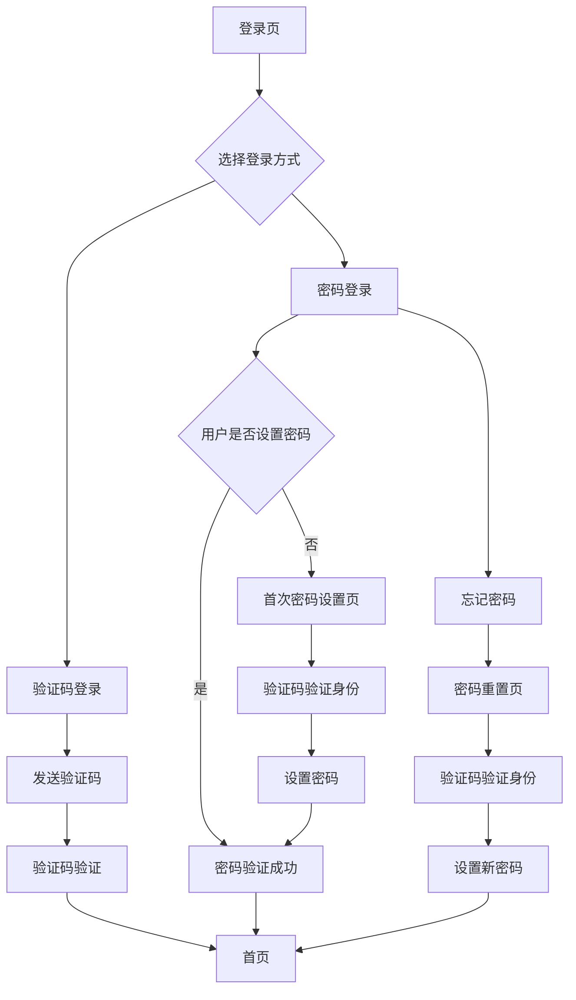

# 产品需求文档 - 密码登录功能增强

## 1. 产品概述

在现有淘贝应用验证码登录系统基础上，增加密码登录功能，为用户提供更便捷的登录方式选择。
该功能将保持现有验证码登录的完整性，同时提供传统密码登录选项，提升用户体验和登录效率。

## 2. 核心功能

### 2.1 用户角色

| 角色   | 注册方式  | 核心权限        |
| ---- | ----- | ----------- |
| 普通用户 | 手机号+验证码注册，设置密码 | 使用验证码或密码登录，访问所有功能 |
| 已注册用户 | 现有用户首次密码登录需设置密码 | 可选择验证码或密码登录方式 |

### 2.2 功能模块

我们的密码登录增强需求包括以下主要页面：

1. 登录页：支持验证码登录和密码登录两种方式切换
2. 注册页：在验证码验证后增加密码设置环节
3. 密码管理页：密码修改和重置功能
4. 首次密码设置页：为已注册用户提供密码设置入口

### 2.3 页面详情

| 页面名称 | 模块名称  | 功能描述        |
| ---- | ----- | ----------- |
| 登录页 | 登录方式切换 | 提供"验证码登录"和"密码登录"两个选项卡切换 |
| 登录页 | 密码登录表单 | 包含手机号输入框、密码输入框、显示/隐藏密码按钮 |
| 登录页 | 忘记密码链接 | 点击跳转到密码重置页面 |
| 登录页 | 登录失败限制 | 同一IP 5次失败后锁定15分钟，显示相应提示 |
| 注册页 | 密码设置区域 | 在验证码验证成功后显示密码设置表单 |
| 注册页 | 密码强度校验 | 实时检测密码强度并显示提示信息 |
| 注册页 | 密码确认输入 | 确保两次密码输入一致 |
| 密码管理页 | 密码修改表单 | 包含原密码、新密码、确认新密码输入框 |
| 密码管理页 | 密码重置功能 | 通过手机验证码重置密码 |
| 首次密码设置页 | 密码设置引导 | 为已注册但未设置密码的用户提供设置入口 |

## 3. 核心流程

**新用户注册流程：**
用户输入手机号 → 获取验证码 → 验证码验证成功 → 设置密码 → 确认密码 → 同意协议 → 注册成功并自动登录

**密码登录流程：**
用户选择密码登录 → 输入手机号和密码 → 系统验证 → 登录成功跳转首页

**已注册用户首次密码登录流程：**
用户选择密码登录 → 输入手机号和密码 → 系统检测用户未设置密码 → 跳转密码设置页 → 通过验证码验证身份 → 设置密码 → 登录成功

**密码重置流程：**
用户点击忘记密码 → 输入手机号 → 获取验证码 → 验证码验证成功 → 设置新密码 → 重置成功

## 4. 用户界面设计

### 4.1 设计风格

* 主色：#1890ff（蓝色），辅色：#f0f0f0（浅灰）
* 按钮风格：圆角按钮，主按钮使用渐变效果
* 字体：系统默认字体，标题16px，正文14px，提示文字12px
* 布局风格：卡片式设计，顶部导航，响应式布局
* 图标风格：使用简洁的线性图标，支持眼睛图标切换密码显示状态

### 4.2 页面设计总览

| 页面名称 | 模块名称  | UI 元素             |
| ---- | ----- | ----------------- |
| 登录页 | 登录方式切换 | Tab选项卡，蓝色激活状态，灰色未激活状态 |
| 登录页 | 密码登录表单 | 圆角输入框，右侧眼睛图标，蓝色聚焦边框 |
| 登录页 | 忘记密码链接 | 蓝色文字链接，右对齐显示 |
| 注册页 | 密码设置区域 | 渐变显示动画，绿色成功提示，红色错误提示 |
| 注册页 | 密码强度指示器 | 进度条样式，弱(红色)、中(橙色)、强(绿色) |
| 密码管理页 | 表单布局 | 垂直排列，标签在上，输入框在下，统一间距 |

### 4.3 响应式

产品采用**移动优先**设计，支持桌面端自适应，针对触控操作进行优化，按钮最小点击区域44px。