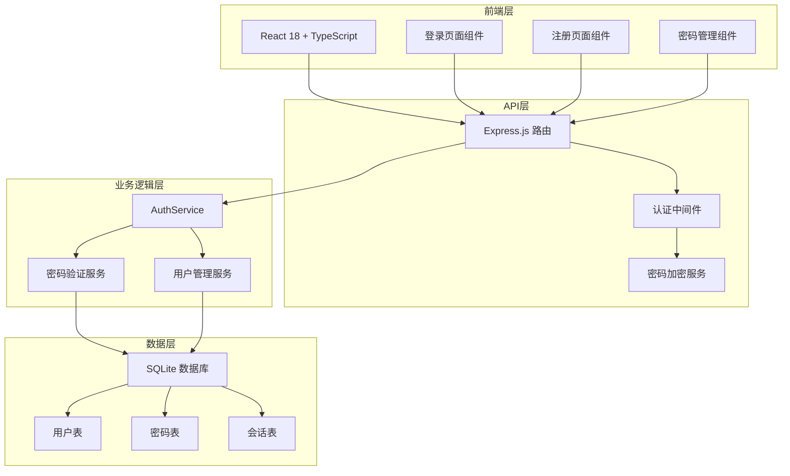
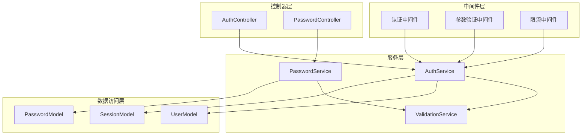
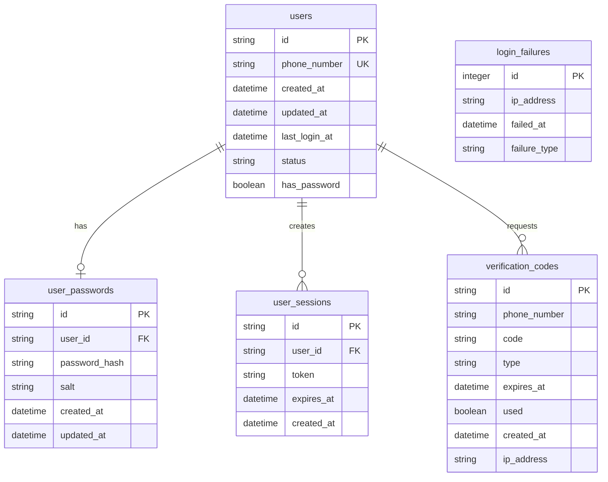

# 技术架构文档 - 密码登录功能增强

## 1. 架构设计



## 2. 技术描述

- 前端：React@18 + TypeScript + Tailwind CSS + Vite
- 后端：Node.js + Express.js + better-sqlite3
- 安全：bcrypt 密码加密 + JWT 认证 + 登录失败限制
- 验证：express-validator 参数校验

## 3. 路由定义

| 路由 | 用途 |
|------|------|
| /login | 登录页，支持验证码和密码两种登录方式 |
| /register | 注册页，包含密码设置功能 |
| /password/set | 首次密码设置页，为已注册用户设置密码 |
| /password/reset | 密码重置页，通过验证码重置密码 |
| /password/change | 密码修改页，需要验证原密码 |
| /profile | 用户信息页，包含密码管理入口 |

## 4. API 定义

### 4.1 核心 API

**密码登录接口：**
```
POST /api/auth/password-login
```

请求：
| 参数名 | 类型 | 必需 | 描述 |
|--------|------|------|------|
| phoneNumber | string | true | 手机号 |
| password | string | true | 密码 |

响应：
| 参数名 | 类型 | 描述 |
|--------|------|------|
| success | boolean | 登录是否成功 |
| message | string | 响应消息 |
| token | string | JWT认证令牌 |
| userId | string | 用户ID |
| needSetPassword | boolean | 是否需要设置密码 |

**密码设置接口：**
```
POST /api/auth/set-password
```

请求：
| 参数名 | 类型 | 必需 | 描述 |
|--------|------|------|------|
| phoneNumber | string | true | 手机号 |
| verificationCode | string | true | 验证码 |
| password | string | true | 新密码 |
| confirmPassword | string | true | 确认密码 |

响应：
| 参数名 | 类型 | 描述 |
|--------|------|------|
| success | boolean | 设置是否成功 |
| message | string | 响应消息 |

**密码修改接口：**
```
POST /api/auth/change-password
```

请求：
| 参数名 | 类型 | 必需 | 描述 |
|--------|------|------|------|
| oldPassword | string | true | 原密码 |
| newPassword | string | true | 新密码 |
| confirmPassword | string | true | 确认新密码 |

响应：
| 参数名 | 类型 | 描述 |
|--------|------|------|
| success | boolean | 修改是否成功 |
| message | string | 响应消息 |

**密码重置接口：**
```
POST /api/auth/reset-password
```

请求：
| 参数名 | 类型 | 必需 | 描述 |
|--------|------|------|------|
| phoneNumber | string | true | 手机号 |
| verificationCode | string | true | 验证码 |
| newPassword | string | true | 新密码 |
| confirmPassword | string | true | 确认新密码 |

响应：
| 参数名 | 类型 | 描述 |
|--------|------|------|
| success | boolean | 重置是否成功 |
| message | string | 响应消息 |

**密码强度校验接口：**
```
POST /api/auth/validate-password
```

请求：
| 参数名 | 类型 | 必需 | 描述 |
|--------|------|------|------|
| password | string | true | 待校验密码 |

响应：
| 参数名 | 类型 | 描述 |
|--------|------|------|
| valid | boolean | 密码是否有效 |
| strength | string | 密码强度：weak/medium/strong |
| errors | array | 错误信息列表 |

## 5. 服务器架构图



## 6. 数据模型

### 6.1 数据模型定义



### 6.2 DDL 语句

```sql
-- 为用户表添加密码标识字段
ALTER TABLE users ADD COLUMN has_password BOOLEAN DEFAULT FALSE;

-- 创建用户密码表
CREATE TABLE IF NOT EXISTS user_passwords (
    id TEXT PRIMARY KEY,
    user_id TEXT NOT NULL,
    password_hash TEXT NOT NULL,
    salt TEXT NOT NULL,
    created_at DATETIME DEFAULT CURRENT_TIMESTAMP,
    updated_at DATETIME DEFAULT CURRENT_TIMESTAMP,
    FOREIGN KEY (user_id) REFERENCES users (id) ON DELETE CASCADE
);

-- 为登录失败表添加失败类型字段
ALTER TABLE login_failures ADD COLUMN failure_type TEXT DEFAULT 'verification_code';

-- 创建索引优化查询性能
CREATE INDEX IF NOT EXISTS idx_user_passwords_user_id ON user_passwords(user_id);
CREATE INDEX IF NOT EXISTS idx_login_failures_ip_type ON login_failures(ip_address, failure_type);
CREATE INDEX IF NOT EXISTS idx_users_phone_password ON users(phone_number, has_password);

-- 初始化数据：为现有用户设置密码标识为false
UPDATE users SET has_password = FALSE WHERE has_password IS NULL;
```

### 6.3 密码安全策略

- 使用 bcrypt 算法进行密码哈希，成本因子设置为 12
- 每个密码使用独立的随机盐值
- 密码传输使用 HTTPS 加密
- 实现密码强度校验：8-20位，包含字母和数字
- 登录失败限制：同一IP 5次失败锁定15分钟
- 密码错误返回统一模糊提示，防止用户枚举攻击